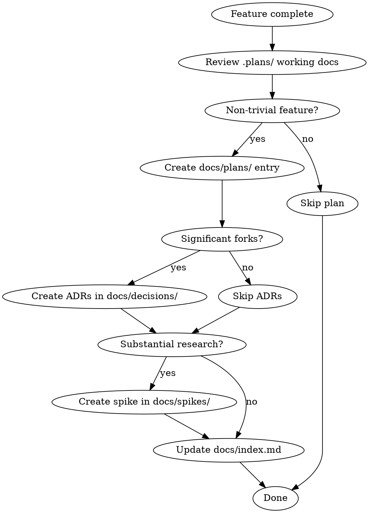

# Project Documentation System

Set up and maintain a `docs/` folder for preserving spikes, decisions, and plans across projects. Works alongside superpowers — superpowers handles the working documents in `.plans/`, this skill handles the permanent docs.

## Setup

Run once per project. Idempotent — safe to run again.

### 1. Create folder structure

```
docs/
  index.md
  decisions/
  plans/
  spikes/
  templates/
    spike.md
    decision.md
    plan.md
```

### 2. Create templates

**`docs/templates/spike.md`:**

```markdown
# [Topic] — Spike

**Date:** YYYY-MM-DD
**Status:** In Progress | Complete
**Author:** [name or "Claude Code"]

## Context
What prompted this investigation?

## Questions
- [ ] Question 1

## Findings
What did we learn?

## Options

### Option A: [Name]
**How it works:** ...
**Pros:** ...
**Cons:** ...

### Option B: [Name]
**How it works:** ...
**Pros:** ...
**Cons:** ...

## Recommendation
Which option and why. Link to ADR if decision was made: `→ decisions/[slug].md`

## Out of Scope
What we chose not to investigate.
```

**`docs/templates/decision.md`:**

```markdown
# [Short title] — Decision

**Date:** YYYY-MM-DD
**Status:** Proposed | Accepted | Superseded by [link]
**Related:** [links to spikes, plans, or other decisions]

## Context
What requires a decision? What constraints exist?

## Decision
What did we decide and why?

## Consequences
What trade-offs does this create? What becomes easier? What becomes harder?
```

**`docs/templates/plan.md`:**

```markdown
# [Feature/Task] — Plan

**Date:** YYYY-MM-DD
**Status:** Draft | In Progress | Complete
**Spec:** [link to spike or design spec]
**Decisions:** [links to related ADRs]

## Goal
What we're building and why.

## Architecture
How the pieces fit together. Tech stack, key patterns, data flow.

## File Map
| File | Action | Purpose |
|------|--------|---------|
| `path/to/file` | Create/Modify | Brief description |

## Tasks
### Task 1: [Name]
- [ ] Step 1
- [ ] Step 2

## Deferred
What was intentionally left out and why.
```

### 3. Create `docs/index.md`

```markdown
# Docs Index

Quick-reference index of all spikes, decisions, and plans. Scan this before starting new feature work.

## Decisions

_No decisions yet._

## Plans

_No plans yet._

## Spikes

_No spikes yet._

## Templates

- [Spike template](templates/spike.md)
- [Decision template](templates/decision.md)
- [Plan template](templates/plan.md)
```

### 4. Add `.plans/` to `.gitignore`

Superpowers working documents are ephemeral — don't commit them.

### 5. Add CLAUDE.md section

Add under `## Documentation` (or an appropriate location):

```markdown
## Documentation

Project documentation lives in `docs/` — see `docs/index.md` for the full index. Before starting new feature work, scan the index for related prior spikes, decisions, and plans. After completing a feature, use the `docs-setup` skill to distill working documents into permanent docs.
```

Keep it short — the skill carries the conventions, not CLAUDE.md.

## Distilling Working Documents

After a feature is complete and superpowers working documents exist in `.plans/`, distill them into permanent docs. This is synthesis, not copy-paste.



### What to capture in each doc type

**Plan (`docs/plans/`):**
- Goal and why it mattered
- Architecture — how pieces fit together, key patterns, data flow
- File map — what was created/modified and why
- Key design decisions (inline or linked to ADRs)
- What was intentionally deferred and why

**Strip out:** Step-by-step commands, exact code snippets, checkbox tracking, commit messages. These are in git history.

**Decision / ADR (`docs/decisions/`):**
- Create for significant architectural forks — choices where a different team might reasonably have gone the other way
- Examples: choosing library A over B, choosing a data modeling approach, choosing a testing strategy
- Skip for obvious or low-stakes choices

**Spike (`docs/spikes/`):**
- Create when investigation produced reusable knowledge beyond the immediate task
- Examples: comparing multiple auth providers, benchmarking database options, evaluating third-party APIs
- Skip if brainstorming was straightforward

### Always update `docs/index.md`

One line per new doc, grouped by type:

```markdown
- [Short Title](type/filename.md) — One-line summary of what this covers
```

### Cross-reference related docs

Plans link to decisions, decisions link to spikes. Use relative paths:

```markdown
**Decisions:** `→ decisions/some-decision.md`
```
